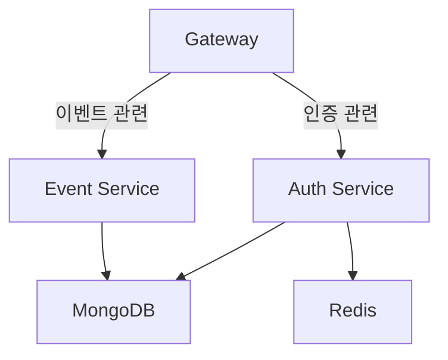

# MSA 이벤트 보상 시스템 과제

## 📦 기술 스택

| 구분     | 내용                         |
|--------|----------------------------|
| 언어     | TypeScript (Node.js 기반)    |
| 프레임워크  | NestJS (Microservices 구조)  |
| 데이터베이스 | MongoDB, Redis             |
| 인프라    | Docker, Docker Compose     |
| 개발 환경  | WSL2, Node.js 18.20.6, npm |
| 기타     | REST API, MSA 구조 설계        |

## ⚙️ 개발 환경

- OS: Windows 11 + WSL2 (Ubuntu 22.04)
- Node.js: 18.20.6
- Docker: 28.1.1, Docker Compose: 2.35.1
- VSCode / Movaxterm / MongoDB Compass

## 🧱 컨테이너 구성

| 서비스         | 포트                    | 설명                                       |
|-------------|-----------------------|------------------------------------------|
| **gateway** | `3000`                | API Gateway – 클라이언트 요청 진입점, REST API 제공  |
| **auth**    | `3001`, `30001(gRPC)` | 인증 서비스 – 회원가입, 로그인, 토큰 관리, Kafka 이벤트 발행  |
| **event**   | `3002`, `30002(gRPC)` | 이벤트/보상 처리 서비스 – 이벤트 생성 및 보상 요청 수신 처리     |
| **mongodb** | `27017`               | MongoDB – 모든 서비스의 메인 데이터 저장소             |
| **redis**   | `6379`                | Redis – 캐시 또는 중복 요청 방지용 세션 저장소로 사용 가능    |
| **kafka**   | `9092`                | Kafka (예정) – 이벤트 브로커, 유저 등록 이벤트 등 비동기 처리 |

## 🧭 시스템 구성도 (Mermaid)



## 🧠 아키텍처 설명

- 서비스 간 통신 방식 (gRPC, REST):
  - Gateway → Auth: gRPC
  - Gateway → Event: gRPC
  - Auth → Event: HTTP
- 인증 및 권한 처리 흐름
  - JWT 기반 인증
  - login 시 accessToken 및 refreshToken 발급
  - accessToken 만료 시 refreshToken으로 재발급 (엔드포인트 구현)
- 이벤트 → 보상 흐름 설명
  - 운영자가 보상(POST /rewards)를 통해 보상을 등록
  - 운영자가 이벤트(POST /events)를 통해 이벤트를 등록 (보상과 이벤트는 1:N 관계이므로 보상을 먼저 등록)
  - 사용자가 이벤트(POST /events/requests) 참여 시 보상 요청

## 🧪 API 목록 (Swagger 기준)

- Auth API
  - POST /auth/register
  - POST /auth/login
  - POST /auth/logout
  - POST /auth/refresh

- Events API
  - POST /events: 이벤트 등록 (운영자)
  - GET /events: 전체 이벤트 목록 조회 (운영자)
  - GET /events/{id}: 이벤트 상세 조회 (운영자)
  - PUT /events/{id}: 이벤트 수정 (운영자)
  - DELETE /events/{id}: 이벤트 삭제 (운영자)

- Rewards API
  - POST /rewards: 보상 등록 (운영자)
  - GET /rewards: 보상 목록 조회 (운영자)
  - GET /rewards/{id}: 보상 상세 조회 (운영자)
  - PUT /rewards/{id}: 보상 수정 (운영자)
  - DELETE /rewards/{id}: 보상 삭제 (운영자)

- Reward Requests API
  - POST /reward-requests: 보상 요청 (유저)
  - GET /reward-requests: 전체 보상 요청 목록 조회 (운영자)
  - GET /reward-requests/mine: 내 보상 요청 이력 조회 (유저)
  - GET /reward-requests/{id}: 보상 요청 상세 조회 (운영자)

## 🛡 역할별 시나리오 정리

- USER: 보상 요청 및 조회
- OPERATOR: 이벤트 등록 및 보상 등록, 보상 요청 이력 조회
- AUDITOR: 전체 보상 요청 목록 조회만 가능
- ADMIN: 모든 API 접근 가능

## 🚧 미구현 / 보완 예정 항목

- **Kafka 기반 보상 이력 저장**  
  현재는 이벤트 보상 요청 시, 이벤트 서비스에서 직접 MongoDB에 저장하도록 구현되어 있음.  
  추후 확장을 고려하여 Kafka를 통해 이벤트를 발행하고, 이를 별도의 컨슈머 서비스가 구독하여 DB 저장 및 보상 지급 로직을 수행하는 구조로 개선 예정.  
  → 비동기 처리, 실패 복구, 로그 트레이싱 측면에서 유리하며, 스케일 아웃도 쉬워짐.  
  *시간상 Kafka publish/consume 구조는 구현하지 못했지만, 전체 Docker 환경 및 healthcheck는 이미 구성되어 있음.*

- **Redis 캐싱 및 유저 상태 관리**  
  현재는 Redis를 사용해 refreshToken만 관리하고 있음.  
  추후 이벤트 참여 여부, 보상 중복 방지 플래그 등 유저 관련 상태를 Redis 캐싱으로 관리하여 응답 속도 개선 및 부하 분산을 고려 중.  
  → 예: 유저가 같은 이벤트에 이미 참여했는지 빠르게 조회하기 위해 Redis key-value 활용.

- **테스트 코드 및 CI/CD 연동**  
  GitHub Actions 및 Ansible 기반 배포를 통한 CI/CD 파이프라인 연결에 사용할 단위 테스트 / e2e 테스트는 추후에 작성 예정.

## 🔧 실행 전 요구 사항

- `localhost:3000`~`3002`번 포트가 비어 있어야 합니다.
- `.env` 파일은 .gitignore에 포함하지 않고 직접 포함했습니다.

## 📝 실행 가이드

- Swagger 접속 URL: `docker-compose up --build -d` 로 컨테이너를 실행 후 `localhost:3000/swagger`에 접속
- 예시 accessToken: `localhost:3000/auth/register`를 통해 아이디(권한 설정 필수)를 등록하고 `localhost:3000/auth/login` 통해 발급받은 accessToken을 등록하고 api를 확인
- 역할별 테스트 절차

## 🗂 디렉토리 구조

```plantext
├── README.md
├── apps
│   ├── auth
│   │   ├── Dockerfile.dev
│   │   ├── eslint.config.mjs
│   │   ├── nest-cli.json
│   │   ├── package-lock.json
│   │   ├── package.json
│   │   ├── src
│   │   │   ├── app.module.ts
│   │   │   ├── auth
│   │   │   ├── common
│   │   │   ├── main.ts
│   │   │   └── proto
│   │   ├── test
│   │   │   ├── app.e2e-spec.ts
│   │   │   └── jest-e2e.json
│   │   ├── tsconfig.build.json
│   │   └── tsconfig.json
│   ├── event
│   │   ├── Dockerfile.dev
│   │   ├── eslint.config.mjs
│   │   ├── nest-cli.json
│   │   ├── package-lock.json
│   │   ├── package.json
│   │   ├── src
│   │   │   ├── app.module.ts
│   │   │   ├── common
│   │   │   ├── events
│   │   │   ├── main.ts
│   │   │   ├── reward-requests
│   │   │   └── rewards
│   │   ├── test
│   │   │   ├── app.e2e-spec.ts
│   │   │   └── jest-e2e.json
│   │   ├── tsconfig.build.json
│   │   └── tsconfig.json
│   └── gateway
│       ├── Dockerfile.dev
│       ├── eslint.config.mjs
│       ├── nest-cli.json
│       ├── package-lock.json
│       ├── package.json
│       ├── src
│       │   ├── app.module.ts
│       │   ├── auth
│       │   ├── common
│       │   ├── events
│       │   ├── main.ts
│       │   ├── reward-requests
│       │   └── rewards
│       ├── test
│       │   ├── app.e2e-spec.ts
│       │   └── jest-e2e.json
│       ├── tsconfig.build.json
│       └── tsconfig.json
└── docker-compose.yaml
```

## 🤔 설계에서 고민한 점

- **RESTful API 설계**  
  RESTful API 원칙에 따라 리소스 중심의 엔드포인트를 구성했습니다.  
  URL은 기능이 아닌 도메인(자원)을 기준으로 설계하였습니다.

- **서비스 확장성 고려**  
  서비스 간 통신은 HTTP가 아닌 **gRPC**를 선택하여 **고성능, 타입 안정성, 추후 다언어 지원**까지 고려한 구조로 설계했습니다.  
  또한 현재는 NestJS 기반의 Node.js 서비스만 존재하지만, 향후 다른 언어 기반 서비스가 추가될 수 있다는 점을 고려해 **의존성 관리는 `npm`을 사용**했습니다.  
  Gateway 서버는 **DDD(도메인 주도 설계)** 방식으로 디렉토리를 구성하여, 도메인(service) 단위로 확장 가능하게 설계했습니다.  
  새로운 도메인이 추가될 경우, 별도 폴더 및 모듈 단위로 독립적으로 관리할 수 있습니다.

- **실무 적용 시 확장 방안**  
  - **Kafka**: 현재는 동기 방식으로 처리하고 있으나, 추후 이벤트 처리량이 많아질 경우, 보상 요청 및 이벤트 등록 등 주요 로직을 Kafka를 통해 비동기적으로 처리할 수 있도록 확장할 계획입니다.
    예를 들어, 이벤트 등록 시 Kafka 토픽에 메시지를 발행하고, 보상 지급 서비스가 이를 구독하여 별도로 저장 및 지급 처리를 수행하는 구조를 고려하고 있습니다.
  - **Redis**: 현재는 refreshToken 저장 용도로만 Redis를 사용하고 있지만, 추후에는 **이벤트 참여 여부 캐싱**, **보상 중복 방지 플래그**, **인기 이벤트 랭킹 캐싱** 등 다양한 캐시 레이어로 확장할 수 있습니다.  
  - **CI/CD 파이프라인 및 테스트 자동화**  
    현재는 시간상 테스트 코드(e2e, unit)를 작성하지 못했지만, 이후 GitHub Actions를 활용한 테스트 자동화 및 Ansible을 활용한 배포 자동화를 고려하고 있습니다. 서비스 구조는 이미 테스트 코드가 쉽게 추가될 수 있도록 **모듈 단위 분리와 DTO 기반 설계**를 적용해두었습니다.
