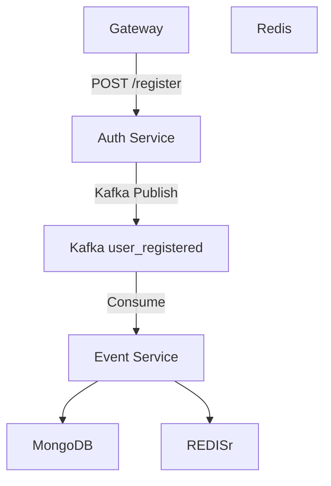

# MSA 서버 구축 과제

> 본 프로젝트는 NestJS 기반 MSA 서버 구축 과제로, Gateway, Auth, Event 서비스 간 비동기 통신과 Kafka를 활용한 이벤트 기반 아키텍처를 다룹니다.

---

## 📦 기술 스택

| 구분     | 내용                                  |
|--------|-------------------------------------|
| 언어     | TypeScript (Node.js 기반)             |
| 프레임워크  | NestJS (Microservices 구조)           |
| 메시징    | Apache Kafka (Bitnami Docker Image) |
| 데이터베이스 | MongoDB, Redis                      |
| 인프라    | Docker, Docker Compose              |
| 개발 환경  | WSL2, Node.js 18.x, pnpm            |
| 기타     | REST API, Kafka Pub/Sub, MSA 구조 설계  |

---

## 🐳 Docker 실행 명령어

> 아래 명령어들은 MSA 서버를 컨테이너 기반으로 띄우기 위한 명령어입니다.

### 💻 빌드 및 실행

```bash
docker compose up --build
```

### 🔄 캐시 무시 재빌드

```bash
docker compose build --no-cache
```

### 🔙 백그라운드 실행

```bash
docker compose up -d
```

---

## ⚙️ 개발 환경

* OS: Windows 11 + WSL2 (Ubuntu 22.04)
* Node.js: 18.x (npm, pnpm 모두 지원)
* Docker: 24.x
* DBeaver / MongoDB Compass / RedisInsight 권장

---

## 🧱 컨테이너 구성

| 서비스     | 포트    | 설명                                  |
|---------|-------|-------------------------------------|
| gateway | 3000  | API Gateway (REST + Kafka Producer) |
| auth    | 3001  | 인증 서비스                              |
| event   | 3002  | 이벤트 소비 서비스 (Kafka Consumer)         |
| kafka   | 9092  | Kafka 브로커 (Bitnami 이미지)             |
| mongodb | 27017 | MongoDB                             |
| redis   | 6379  | Redis                               |

---

## 🧭 시스템 구성도 (Mermaid)



---

## 🚀 서비스 실행 예시

```bash
# 특정 서비스만 실행
docker compose up auth

# gateway 개발 서버 실행
pnpm --filter gateway run start:dev
```

---

## 🧠 아키텍처 설명 (추후 보강 예정)

* MSA 구조에서 서비스 간 decoupling을 위해 Kafka 사용
* 인증 후 이벤트를 발행하고, 이벤트 서비스에서 후속 처리 (DB 저장, 로깅 등)
* API Gateway에서 요청을 라우팅하며 인증/요청/발행 책임 분리
* Kafka를 사용함으로써 유저 응답 처리와 후속 작업을 비동기화
